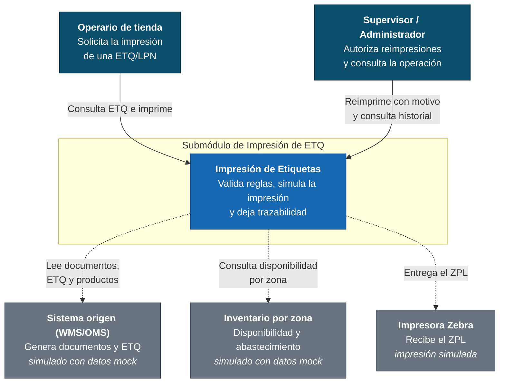
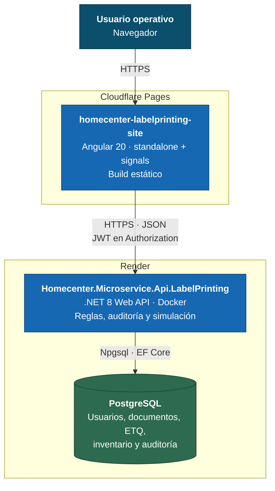
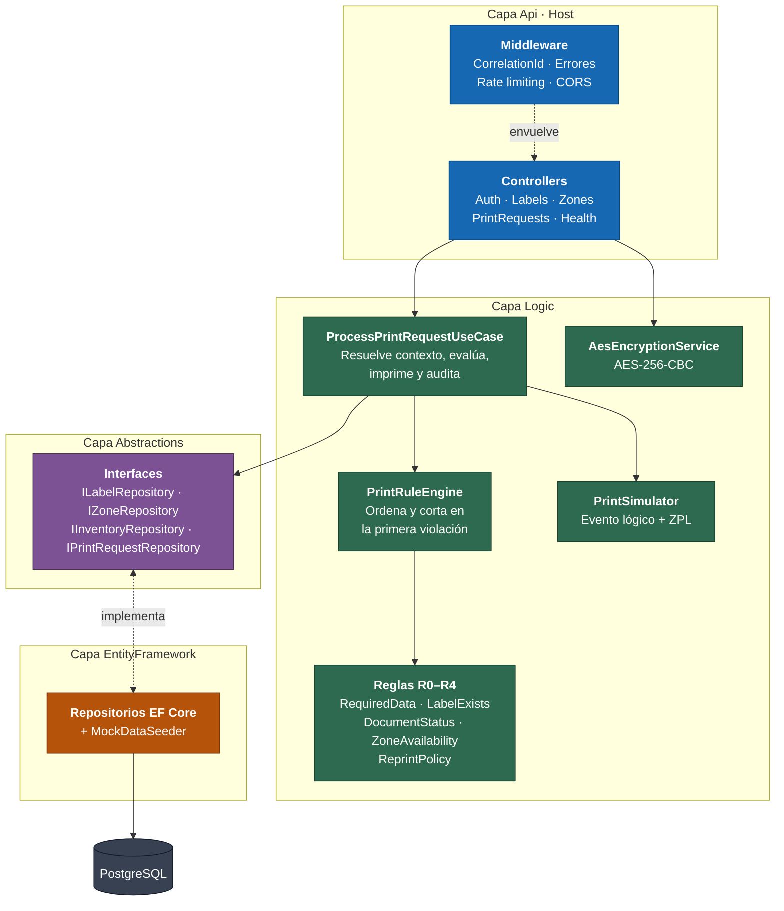
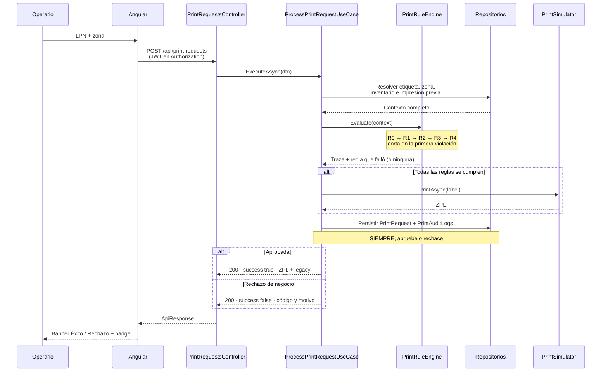

# Diagramas C4

Tres niveles, del contexto al detalle. Se escriben en Mermaid para que se versionen
junto al código y se rendericen directamente en GitHub: un diagrama en imagen se
desactualiza sin que nadie lo note.

---

## Nivel 1 — Contexto

Quién usa el submódulo y con qué sistemas habla.

Los tres sistemas externos aparecen punteados porque **están simulados**: el enunciado
pide operar desacoplado de sistemas corporativos reales. Se dibujan igual porque definen
las fronteras que la solución tendría en producción.

---

## Nivel 2 — Contenedores

Cómo se reparte la solución en piezas desplegables.

**Viven en dominios distintos**, y eso tiene tres consecuencias que no son
accidentales:

- CORS es requisito de funcionamiento, no un ajuste: sin el origen registrado, la
  aplicación no opera.
- El JWT viaja en el header `Authorization`, no en cookie, para evitar por completo la
  fricción de cookies cross-site.
- El `apiUrl` se resuelve en tiempo de build, así que la URL de Render debe conocerse
  **antes** de publicar el frontend.

---

## Nivel 3 — Componentes del API

Cómo fluye una solicitud de impresión por dentro.

La flecha entre `Abstractions` y `EntityFramework` apunta **hacia el dominio**: la capa
de datos implementa interfaces que declara el dominio, no al revés. Por eso
`PrintRuleEngine` y las reglas pueden probarse sin base de datos.

---

## Flujo de una solicitud de impresión

Los dos puntos que este diagrama existe para dejar explícitos: **la auditoría se
persiste antes de responder y no depende del resultado**, y **el rechazo de negocio
viaja como 200**, porque la solicitud se procesó bien aunque la impresión no proceda.
