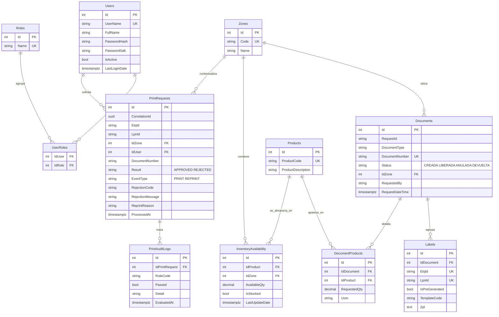
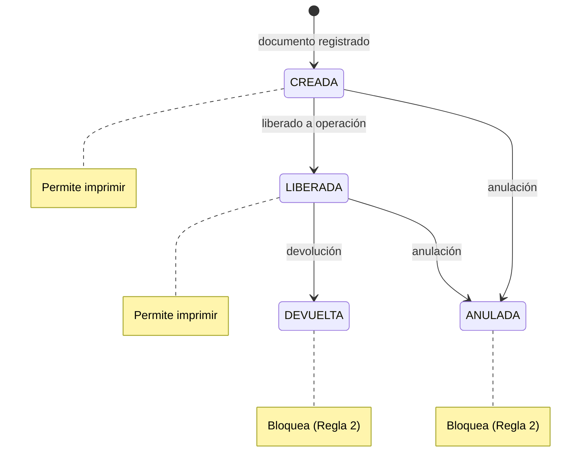
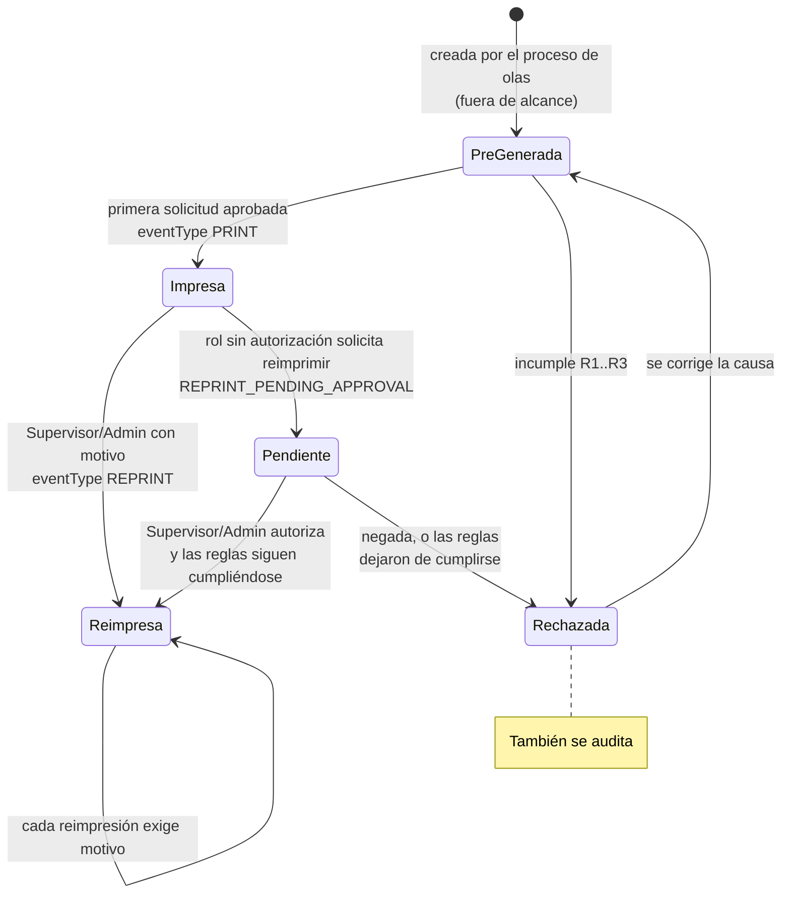

# Modelo de dominio y esquema de datos

## Diagrama entidad-relación

## Por qué el modelo tiene esta forma

**El anexo entrega una vista de negocio plana y aquí se normaliza en ocho tablas.**
`tableOrders.json` mezcla documento, zona, etiquetas y productos en un solo objeto. Esa
forma sirve para transportar, no para consultar: la Regla 3 necesita cruzar producto ×
zona, y eso exige que ambos sean entidades.

**Los productos cuelgan del documento, no de la etiqueta.** En el anexo, `labels` es un
arreglo pero `products` está al mismo nivel, asociado al documento. Se modela así:
todas las etiquetas de un documento comparten sus productos.

**`Labels.LpnId` y `Labels.EtqId` son únicos.** Son la llave funcional de entrada del
servicio. Sin la restricción, un LPN duplicado haría que la resolución dependiera del
orden de inserción.

**`InventoryAvailability` tiene índice único por `IdProduct + IdZone`.** Dos filas para
el mismo producto en la misma zona harían que la validación de inventario dependiera de
cuál se leyera primero.

**`PrintRequests` indexa `LpnId + ProcessedAt`.** Es la consulta que resuelve tanto la
detección de reimpresión como el historial ordenado.

**Toda solicitud genera fila en `PrintRequests`, apruebe o rechace.** La auditoría nunca
es condicional: los rechazos son justamente lo que se investiga durante un incidente.
Un LPN mal digitado repetidamente sería invisible si solo se registraran los éxitos.

**`PrintAuditLogs` guarda una fila por regla evaluada.** Permite responder *qué se
validó y en qué orden*, no solo *qué falló*. Como el motor corta en la primera
violación, la cantidad de filas revela hasta dónde llegó la evaluación.

**Las tablas funcionales llevan `State` para eliminación lógica.** En una operación
logística los registros no se borran, se desactivan: borrar una zona dejaría huérfana la
auditoría que la referencia.

## Campos deliberadamente desnormalizados

`PrintRequests` guarda `EtqId`, `LpnId` y `DocumentNumber` como texto en lugar de solo
las llaves foráneas. Es intencional:

- Cuando el LPN **no existe**, no hay `Label` a la cual apuntar — y ese caso igual debe
  auditarse.
- La auditoría debe conservar lo que ocurrió **en ese momento**. Si mañana se corrige el
  número de un documento, el registro histórico no debe cambiar retroactivamente.

## Mapeo BD → Backend → Frontend

La nomenclatura es consistente por capa: columnas y propiedades C# en `PascalCase`,
propiedades TypeScript en `camelCase`. Los nombres se mantienen alineados a propósito
para que un cambio de contrato sea visible de inmediato.

| Tabla | Entidad C# | DTO | Modelo TypeScript |
|---|---|---|---|
| `Users` | `User` | `AuthUserDto` | `AuthUserDto` |
| `Roles` / `UserRoles` | `Role` / `UserRole` | *(roles en el DTO de usuario)* | `roles: string[]` |
| `Zones` | `Zone` | `ZoneDto` | `ZoneDto` |
| `Documents` | `Document` | `DocumentSummaryDto` | `DocumentSummaryDto` |
| `Labels` | `Label` | `LabelDetailDto` | `LabelDetailDto` |
| `Products` / `DocumentProducts` | `Product` / `DocumentProduct` | `ProductAvailabilityDto` | `ProductAvailabilityDto` |
| `InventoryAvailability` | `InventoryAvailability` | *(se fusiona en `ProductAvailabilityDto`)* | — |
| `PrintRequests` | `PrintRequest` | `PrintResultDto` · `PrintHistoryItemDto` | idénticos |
| `PrintAuditLogs` | `PrintAuditLog` | *(no se expone)* | — |

**`PasswordHash` y `PasswordSalt` no aparecen en ningún DTO ni modelo del frontend.** No
tienen por qué salir de la capa de datos.

`InventoryAvailability` no tiene DTO propio: sus dos campos relevantes (`availableQty`,
`isStocked`) se fusionan en `ProductAvailabilityDto` junto a `isEligible`, que es la
conclusión ya calculada. El frontend no debería tener que reimplementar la regla para
saber si un producto habilita la impresión.

## Estados y transiciones

`DocumentStatusRule` declara la lista de estados **bloqueados**, no la de permitidos: si
mañana aparece un estado nuevo, el comportamiento por defecto es permitir la impresión,
que es lo que el enunciado define.

## Ciclo de vida de una ETQ

